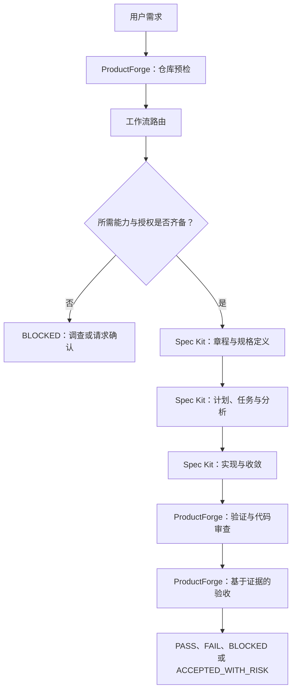

# ProductForge

**简体中文** | [English](README.en.md)

> 面向 Codex 的产品研发编排层。

ProductForge 将产品需求、规格驱动开发、AI Coding Agent、质量验证与产品验收连接起来，建立以证据为依据的工程闭环。

**🚧 早期开发阶段** — Skill 基础与质量门禁加固规则已编写完成；加固后的运行时回归与 Spec Kit 端到端验证尚未完成。本项目尚未达到生产就绪状态。

[GitHub](https://github.com/LissH2003/product-forge) · [CNB](https://cnb.cool/Viper_NB/product-forge) · [快速开始](#快速开始) · [开发状态](#开发状态) · [参与贡献](#参与贡献)

ProductForge 是基于指令的 **Product Engineering Skill**，当前面向 Codex。它引导 Agent 从产品需求出发，完成仓库探查、工作流选择、规格驱动开发、审查与验收。Skill 的名称是 `product-engineering`，ProductForge 是维护该 Skill 的项目。

它集成 **Spec Kit**，不是 Spec Kit 的替代品、分叉、独立工作流引擎，也不捆绑安装 Spec Kit。

## 为什么需要 ProductForge？

写代码只是交付产品变更的一部分。Agent 即使通过测试，也可能偏离用户目标、自行发明业务规则，或丢失原始任务。

| 常见问题 | ProductForge 规定的应对方式 |
|---|---|
| 一句需求直接变成代码 | 先理解目标、检查仓库并选择工作流 |
| 规格与实现逐渐脱节 | 使用官方 Spec Kit 产物，对照当前需求检查证据 |
| 技术选择变成未经批准的业务决策 | 推断或验证技术事实；上报尚未明确的业务语义 |
| 一个任务遇到未知问题，就转而完成另一个任务 | 保留原始任务身份及其阻塞状态 |
| 测试通过被等同于产品完成 | 分别提供审查与验收证据 |

这些是 Skill 中的执行规则，不是外部运行时强制保证的行为。Agent 是否遵守规则仍需验证。

## 工作方式

正式研发路径遵循下列流程。前置条件缺失时，依赖它的工作必须阻塞；流程图不表示各阶段已通过端到端验证。



需要时进行澄清；检查失败后返回受影响的阶段。符合条件的局部缺陷修复、不改变行为的小型重构、维护和只读调查，可以明确选择轻量路径，而不必执行完整 Spec Kit 生命周期。

## 架构与职责

**ProductForge 管理工程过程；Spec Kit 提供正式 SDD 产物与工作流。** Coding Agent 使用目标仓库中可用的工具和权限执行指令。

| 层级 | 职责 | 边界 |
|---|---|---|
| ProductForge | 探测、路由、治理、验证与验收 | 不伪造替代性 Spec Kit 产物，不改写其受管状态 |
| Spec Kit | 根据已安装集成的实际能力，提供 constitution、specify、clarify、plan、tasks、analyze、implement 与 converge | 保持官方工作流与核心模板的权威来源 |
| 项目 | 源码、测试、配置、需求与项目规则 | 变更限定在用户授权范围内 |
| 用户 | 产品意图与尚未明确的重要决策 | 宽泛的开发授权不代表豁免安全或质量门禁 |

ProductForge 的产品简报、决策、审查和验收模板用于记录上下文与证据。它们引用正式产物，不建立第二套规格事实来源。

## 核心能力

以下能力已在**当前 Skill 指令中定义**，不应理解为已获得运行时验证的功能清单。

| 领域 | 包含的指引 | 当前状态 |
|---|---|---|
| 产品研发 | 需求理解、仓库预检、工作流路由 | 基础已编写 |
| 规格驱动开发 | 能力探测、集成契约、规格、计划与任务门禁 | 契约已编写；官方端到端验证待完成 |
| Agent 治理 | 自主决策策略、人工门禁、风险升级、UNKNOWN 处理、任务绑定 | 规则已加固；运行时回归待完成 |
| 质量保障 | 基于证据的验证、独立审查、验收与完成门禁 | 规则与配套模板已编写；运行时回归待完成 |

以 [Skill 入口](.agents/skills/product-engineering/SKILL.md)中的指令为准。

## Spec Kit 集成

ProductForge **集成 Spec Kit，而不是复制它**。集成契约要求 Agent 检查实际环境：可用工具、项目初始化状态、集成文件、官方 Skills、feature 产物与相关定制。历史参考版本不代表普遍兼容性保证。

当前契约将正式阶段委托给官方 Spec Kit 能力，包括 constitution、specify、clarify、plan、tasks、analyze、implement 和 converge。具体可用性和调用方式必须依据已安装的集成核实。安装与工作流说明见 [Spec Kit 官方仓库](https://github.com/github/spec-kit)；所有权与门禁规则见 [ProductForge 集成契约](.agents/skills/product-engineering/references/spec-kit-integration.md)。

当所选路径需要 Spec Kit，而必要能力不可用时，规定的结果是 **BLOCKED**。Agent 可以安全调查并说明恢复条件，但不能继续依赖该能力的实现、伪造产物或宣称验收通过。

ProductForge 不自动安装、初始化、升级或修复 Spec Kit。这些属于单独的前置条件维护操作。它也不自动部署、发布版本、创建 Issue 或 Pull Request。

## 自主决策与安全门禁

目标不是无限制自主：**证据能够解决的问题自行解决；仍属于用户的重要业务决策必须暂停确认。**

| 级别 | 策略 | 示例 |
|---|---|---|
| A — 自动推断 | 读取现有证据，不要求用户重复提供信息 | 从仓库文件识别包管理器 |
| B — 自动验证 | 在授权与风险可控的范围内执行检查 | 复现缺陷并运行回归测试 |
| C — 可逆决策 | 在范围内选择，记录理由与回退边界 | 选择符合项目约定的低风险实现细节 |
| D — 人工门禁 | 重要操作前请求知情确认 | 明确谁可以删除用户，以及数据是否可恢复 |

纯函数或技术上可逆的改动，也可能承载高风险业务决策。尚未明确的权限、删除语义、数据保留或恢复规则，不能变成隐藏在代码中的假设。

当前加固定义了四项约束：

- **SPEC_KIT_REQUIRED_GATE：** 实现前由路由确定依赖。工具缺失不能成为降低已选正式路径要求的理由。
- **HUMAN_GATE：** 未明确的关键业务语义阻塞实现，直到结合上下文、备选方案、影响与安全默认值获得确认。
- **TASK_BINDING：** 原始目标、任务身份、证据与验收保持关联。无关修复不能使被阻塞的任务变成完成。
- **ACCEPTANCE_PASS_GATE：** 必要证据缺失、存在关键 UNKNOWN、决策未确认或违反风险门禁时，禁止 PASS 和 COMPLETED。

详见[自主决策策略](.agents/skills/product-engineering/references/autonomy-policy.md)与[工作流路由](.agents/skills/product-engineering/references/workflow-routing.md)。

### 任务状态与验收

任务状态为 `PENDING`、`IN_PROGRESS`、`BLOCKED`、`COMPLETED` 和 `CANCELLED`。如果 UNKNOWN 阻止原始目标的实现或验收，该任务必须进入 BLOCKED。这些是报告规则，不是独立的状态数据库。

验收结论与任务状态分开：`PASS`、`FAIL`、`BLOCKED` 或 `ACCEPTED_WITH_RISK`。

**只有同一任务的验收为 PASS，且全部必要门禁满足，才允许标记 COMPLETED。**

`ACCEPTED_WITH_RISK ≠ COMPLETED`

测试通过、代码审查通过、实现结束或 Spec Kit 工作流结束，单独任何一项都不足以宣称完成。正式交付需要规格、计划、任务、实现、测试、审查与验收标准证据。轻量任务采用实现前确定的要求，不能事后豁免缺失的正式证据。

详见[证据与质量门禁](.agents/skills/product-engineering/references/evidence-and-quality-gates.md)及[产品验收](.agents/skills/product-engineering/references/product-acceptance.md)。

## 快速开始

### 当前开发版使用方式

仓库尚无打包的 ProductForge 安装器。需要 Git，以及支持本地 Skill 的可用 Codex 环境。正式研发还需要单独准备 Spec Kit 项目及必要的官方 Codex 集成。

**1. 获取源码。**

```sh
git clone https://github.com/LissH2003/product-forge.git
cd product-forge
```

也可以使用上方链接中的 CNB 仓库。此仓库包含 Skill，不包含演示应用，也不是已初始化的 Spec Kit 项目。

**2. 在 Codex 中打开仓库并检查 Skill。**

Codex 从 `.agents/skills` 发现仓库级 Skills。在 Codex CLI 或 IDE 扩展中，使用 `/skills` 或输入 `$` 选择 `product-engineering`。如果未显示，先检查位置与启用状态，必要时重启 Codex。详见 [Codex 官方 Skill 文档](https://learn.chatgpt.com/docs/build-skills)。

在 Codex 对话中尝试一个只读请求：

```text
$product-engineering
请只读检查此仓库，不修改文件。识别项目结构，
说明适用的工作流，并报告缺失的前置条件。
不要安装工具，也不要开始实现。
```

这只是发现能力检查，不是端到端交付测试。`$product-engineering` 应输入对话，而不是终端。

**3. 在隔离的目标项目中评估。**

如需在其他仓库使用，将本仓库完整的 `product-engineering` 文件夹放入目标仓库的 `.agents/skills/`，保留引用文件和模板。先检查是否已有同名文件夹；不要覆盖其他 Skill，也不要将整个 `.agents/` 目录覆盖到项目配置上。在目标仓库打开 Codex，并确认所选 Skill 的来源。

尝试正式路径之前，按照官方文档单独准备 Spec Kit。如果必要能力缺失，预期结果应为 BLOCKED，而不是自动安装或降级实现。先使用可丢弃的项目，不要将生产凭据带入评估环境。

## 项目结构

```text
product-forge/
├── README.md
├── README.en.md
├── .gitignore
└── .agents/
    └── skills/
        └── product-engineering/
            ├── SKILL.md
            ├── references/
            │   ├── workflow-routing.md
            │   ├── spec-kit-integration.md
            │   ├── autonomy-policy.md
            │   ├── evidence-and-quality-gates.md
            │   └── product-acceptance.md
            └── templates/
                ├── product-brief.md
                ├── decision-record.md
                ├── review-report.md
                └── acceptance-report.md
```

`SKILL.md` 是入口；`references/` 存放按需读取的规则与工作流知识；`templates/` 存放产品研发辅助文档，**不是 Spec Kit 核心模板的副本**。本地隔离测试项目与生成日志不属于受版本管理的 Skill 分发内容。

## 开发状态

| 里程碑 | 状态 |
|---|---|
| Product Engineering Skill 基础 | 已完成 |
| Spec Kit 集成架构与契约 | 已编写；不代表端到端认证 |
| 质量门禁与验收加固 | 已完成；静态审查与人工 Review 通过 |
| 加固后运行时回归 | 待完成 |
| Spec Kit 端到端验证 | 待完成 |
| 生产就绪 | 尚未达到 |

此前的隔离运行时评估发现了门禁绕过、业务确认遗漏、任务漂移和缺乏依据的完成声明。当前加固针对这些规则进行了调整，但实际运行效果尚未验证，其他验证发现也仍未关闭。稳定源码基线不等于生产版本，也不代表对其他 AI Coding Agent 的普遍兼容性承诺。

## 路线图

以下是发展方向，不是交付承诺：

- [x] Product Engineering Skill 基础
- [x] Spec Kit 集成架构
- [x] 自主决策策略与任务绑定
- [x] 证据与验收门禁定义
- [ ] 加固后运行时回归
- [ ] 官方 Spec Kit 端到端验证
- [ ] 扩展工作流与恢复场景覆盖
- [ ] Skill 打包与分发
- [ ] v1.0 稳定化

## 参与贡献

欢迎聚焦的文档改进、可复现的行为报告与范围明确的小型变更。提出变更前，请阅读 Skill 入口和相关引用文档。

- 保持与 Spec Kit 的职责边界，不在 ProductForge 内部分叉或重新实现它。
- 避免重复规格或第二套事实来源。
- 为每项新增 Agent 行为提供具体的验证方法，包括失败场景。
- 高风险操作必须经过明确门禁，并保留用户的原始任务。
- 报告预期行为、实际行为、环境与脱敏证据；区分静态审查和运行时验证。
- 不提交凭据、本地日志和无关测试项目。

提出工作流变更时，请附上可复现的场景和范围明确的验证计划。代码测试通过，本身不能证明 Agent 遵守了预期流程。

## 许可证

**许可证：待定（TBD）。** 仓库尚未添加 LICENSE 文件。本 README 不授予开源许可。
