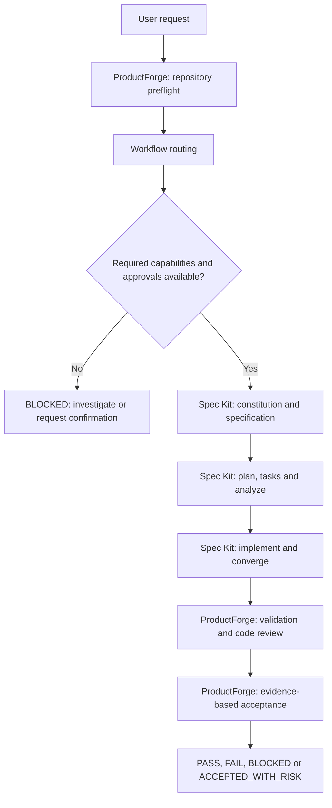

# ProductForge

> A product engineering orchestration layer for Codex.

ProductForge 将产品需求、规格驱动开发、AI Coding Agent、质量验证与产品验收连接起来，目标是建立以证据为依据的工程闭环。

**🚧 Early Development** — The Skill foundation and gate-hardening rules are written. Runtime regression and Spec Kit end-to-end validation remain pending. This is not production-ready software.

[GitHub](https://github.com/LissH2003/product-forge) · [CNB](https://cnb.cool/Viper_NB/product-forge) · [Quick Start](#quick-start) · [Development Status](#development-status) · [Contributing](#contributing)

ProductForge is an instruction-based **Product Engineering Skill**, currently targeting Codex. It guides an agent from a product request through repository discovery, workflow selection, specification-driven development, review, and acceptance. The Skill is named `product-engineering`; ProductForge is the project that maintains it.

It integrates **Spec Kit**. It is not a replacement, fork, standalone workflow engine, or bundled installation of Spec Kit.

## Why ProductForge?

Writing code is only one part of delivering a product change. An agent can pass tests while missing the user's goal, inventing a business rule, or losing track of its original task.

| Common failure | ProductForge's prescribed response |
|---|---|
| A short request turns straight into code | Understand the goal, inspect the repository, and select a workflow first |
| Specifications and implementation drift apart | Use official Spec Kit artifacts and check evidence against the current requirements |
| Technical choices become unapproved business decisions | Infer or test technical facts; escalate unresolved business semantics |
| An unknown blocks one task, so the agent completes another | Preserve the original task identity and its blocked state |
| Green tests become a claim of product completion | Require separate review and acceptance evidence |

These are execution rules in the Skill, not guarantees enforced by an external runtime. Agent compliance must be tested.

## How It Works

The formal development route follows this sequence. Missing prerequisites block dependent work; the diagram does not imply that every stage has been validated end to end.



Clarification is used when needed. Failed checks return work to the affected stage. Eligible local bug fixes, small behavior-preserving refactors, maintenance, and read-only investigations can use an explicitly selected lightweight route instead of the full Spec Kit lifecycle.

## Architecture & Responsibilities

**ProductForge governs the engineering process; Spec Kit supplies the formal SDD artifacts and workflows.** The coding agent executes the instructions using the tools and permissions available in the target repository.

| Layer | Responsibility | Boundary |
|---|---|---|
| ProductForge | Detect, route, govern, validate, and accept | Does not manufacture substitute Spec Kit artifacts or rewrite its managed state |
| Spec Kit | Constitution, specify, clarify, plan, tasks, analyze, implement, and converge, as available in the installed integration | Remains the source of its official workflows and core templates |
| Project | Source code, tests, configuration, requirements, and project rules | Changes stay within the user's authorized scope |
| User | Product intent and unresolved consequential decisions | Broad development permission does not waive safety or quality gates |

ProductForge's brief, decision, review, and acceptance templates record context and evidence. They reference formal artifacts rather than creating a second specification source of truth.

## Core Capabilities

The following capabilities are **defined in the current Skill instructions**. They should not be read as a list of runtime-certified features.

| Area | Included guidance | Current status |
|---|---|---|
| Product Engineering | Requirement understanding, repository preflight, workflow routing | Foundation written |
| Spec-Driven Development | Capability detection, integration contract, specification, planning, and task gates | Contract written; official E2E pending |
| Agent Governance | Autonomy policy, human gates, risk escalation, UNKNOWN handling, task binding | Hardened rules; runtime regression pending |
| Quality | Evidence-based validation, independent review, acceptance, completion gates | Rules and supporting templates written; runtime regression pending |

Start with the [Skill entry point](.agents/skills/product-engineering/SKILL.md) for the authoritative instructions.

## Spec Kit Integration

ProductForge **integrates Spec Kit rather than copying it**. Its contract requires the agent to inspect the actual environment: available tools, project initialization, integration files, official Skills, feature artifacts, and relevant customizations. A historical reference version is not a universal compatibility guarantee.

The current contract delegates formal stages to official Spec Kit capabilities, including constitution, specify, clarify, plan, tasks, analyze, implement, and converge. Exact availability and invocation must be verified against the installed integration. See [Spec Kit upstream](https://github.com/github/spec-kit) for its setup and workflow documentation, and the [ProductForge integration contract](.agents/skills/product-engineering/references/spec-kit-integration.md) for ownership and gate rules.

When a route requires Spec Kit and a required capability is unavailable, the prescribed result is **BLOCKED**. The agent may investigate safely and describe recovery conditions; it must not continue dependent implementation, fabricate artifacts, or claim acceptance.

ProductForge does not automatically install, initialize, upgrade, or repair Spec Kit. Those are separate prerequisite-maintenance actions. It also does not automatically deploy, publish releases, or create issues and pull requests.

## Autonomy & Safety Gates

The aim is not unrestricted autonomy: **resolve what evidence can settle, and stop where a consequential business decision still belongs to the user.**

| Level | Policy | Example |
|---|---|---|
| A — Auto Infer | Read available evidence instead of asking the user to repeat it | Identify the package manager from repository files |
| B — Auto Verify | Use authorized, risk-controlled checks | Reproduce a bug and run regression tests |
| C — Reversible Decision | Choose within scope and record the rationale and rollback boundary | Select a low-risk implementation detail consistent with the project |
| D — Human Gate | Request informed confirmation before consequential action | Resolve who may delete users and whether their data can be recovered |

A pure function or technically reversible edit can still encode a high-risk business decision. Unclear permissions, deletion semantics, retention, or recovery rules must not become assumptions hidden in code.

The current hardening defines four constraints:

- **SPEC_KIT_REQUIRED_GATE:** routing determines the dependency before implementation. Missing tools cannot justify downgrading an already-required formal route.
- **HUMAN_GATE:** unresolved critical business semantics block implementation until confirmed with context, alternatives, impacts, and a safe default.
- **TASK_BINDING:** the original goal, task identity, evidence, and acceptance stay linked. An unrelated fix cannot complete a blocked task.
- **ACCEPTANCE_PASS_GATE:** missing required evidence, critical UNKNOWNs, unconfirmed decisions, or violated risk gates prohibit PASS and COMPLETED.

See the [autonomy policy](.agents/skills/product-engineering/references/autonomy-policy.md) and [workflow routing](.agents/skills/product-engineering/references/workflow-routing.md).

### Task State & Acceptance

Task states are `PENDING`, `IN_PROGRESS`, `BLOCKED`, `COMPLETED`, and `CANCELLED`. An UNKNOWN that prevents the original goal from being implemented or accepted puts that task in BLOCKED. These are reporting rules, not a separate state database.

Acceptance decisions are distinct: `PASS`, `FAIL`, `BLOCKED`, or `ACCEPTED_WITH_RISK`.

**Only Acceptance PASS for the same task, with every required gate satisfied, permits COMPLETED.**

`ACCEPTED_WITH_RISK ≠ COMPLETED`

Passing tests, passing code review, finishing implementation, or finishing a Spec Kit workflow is not sufficient on its own. A formal delivery requires specification, plan, tasks, implementation, tests, review, and acceptance-criteria evidence. Lightweight tasks use requirements determined before implementation; missing formal evidence cannot be waived retroactively.

Details: [evidence and quality gates](.agents/skills/product-engineering/references/evidence-and-quality-gates.md) · [product acceptance](.agents/skills/product-engineering/references/product-acceptance.md).

## Quick Start

### Current development setup

There is no packaged ProductForge installer in this repository. You need Git and a working Codex environment with local Skill support. Formal development also requires a separately prepared Spec Kit project with the necessary official Codex integration.

**1. Get the source.**

```sh
git clone https://github.com/LissH2003/product-forge.git
cd product-forge
```

The CNB repository linked above is an alternative source. This checkout contains the Skill, not a demonstration application or a ready-initialized Spec Kit project.

**2. Open this checkout in Codex and inspect the Skill.**

Codex discovers repository Skills under `.agents/skills`. In Codex CLI or the IDE extension, use `/skills` or type `$` to select `product-engineering`. If it is not visible, check its location and enabled state, then restart Codex if needed. See the [official Codex Skill documentation](https://learn.chatgpt.com/docs/build-skills).

Try a read-only request in the Codex conversation:

```text
$product-engineering
Inspect this repository without changing files. Identify its structure,
explain the applicable workflow, and report missing prerequisites.
Do not install tools or start implementation.
```

This is a discovery check, not an end-to-end delivery test. The `$product-engineering` reference belongs in the conversation, not in a shell.

**3. Evaluate in an isolated target project.**

For repo-scoped use elsewhere, place the entire `product-engineering` folder from this checkout under the target repository's `.agents/skills/`, preserving its references and templates. Inspect any existing folder first; do not overwrite another Skill or copy the whole `.agents/` directory over project configuration. Open Codex in that target repository and confirm the selected Skill's source.

Prepare Spec Kit separately using its official documentation before attempting a formal route. If its required capabilities are missing, expect BLOCKED—not automatic installation or fallback implementation. Begin with a disposable project and keep production credentials out of the evaluation environment.

## Project Structure

```text
product-forge/
├── README.md
├── .gitignore
└── .agents/
    └── skills/
        └── product-engineering/
            ├── SKILL.md
            ├── references/
            │   ├── workflow-routing.md
            │   ├── spec-kit-integration.md
            │   ├── autonomy-policy.md
            │   ├── evidence-and-quality-gates.md
            │   └── product-acceptance.md
            └── templates/
                ├── product-brief.md
                ├── decision-record.md
                ├── review-report.md
                └── acceptance-report.md
```

`SKILL.md` is the entry point; `references/` holds on-demand rules and workflow knowledge; `templates/` holds Product Engineering support documents, **not copies of Spec Kit's core templates**. Local isolated test projects and generated logs are not part of the tracked Skill distribution.

## Development Status

| Milestone | Status |
|---|---|
| Product Engineering Skill foundation | Completed |
| Spec Kit integration architecture and contract | Written; not an E2E certification |
| Gate & Acceptance hardening | Completed; static review and human review passed |
| Post-hardening runtime regression | Pending |
| Spec Kit end-to-end validation | Pending |
| Production readiness | Not achieved |

Earlier isolated runtime evaluation found gate bypasses, missed business confirmation, task drift, and unsupported completion claims. The current hardening addresses those rules, but its runtime effectiveness remains unverified. Other validation findings remain open. Do not interpret the stable source baseline as a production release or a blanket compatibility claim for other AI coding agents.

## Roadmap

The following items describe direction, not delivery commitments:

- [x] Product Engineering Skill foundation
- [x] Spec Kit integration architecture
- [x] Autonomy policy and task binding
- [x] Evidence and acceptance gate definitions
- [ ] Post-hardening runtime regression
- [ ] Official Spec Kit end-to-end validation
- [ ] Extended workflow and recovery coverage
- [ ] Skill packaging and distribution
- [ ] v1.0 stabilization

## Contributing

Focused documentation improvements, reproducible behavior reports, and narrowly scoped changes are welcome. Before proposing a change, read the Skill entry point and the relevant reference.

- Preserve the boundary with Spec Kit; do not fork or reimplement it inside ProductForge.
- Avoid duplicate specifications or a second source of truth.
- Give every new agent behavior a concrete validation method, including failure cases.
- Keep high-risk actions behind explicit gates and preserve the user's original task.
- Report expected behavior, actual behavior, environment, and sanitized evidence. Distinguish static review from runtime validation.
- Keep credentials, local logs, and unrelated test projects out of contributions.

Propose workflow changes with a reproducible scenario and a bounded validation plan. A passing code test alone is not evidence that an agent followed the intended process.

## License

**License: TBD.** No LICENSE file has been added. No open-source license grant is declared by this README.
